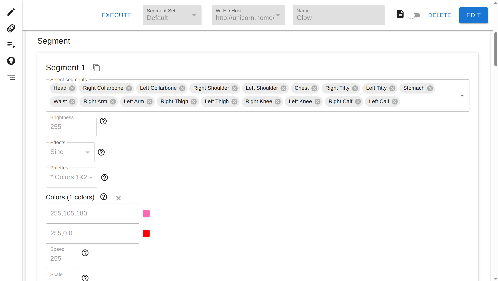

# WLED Seq

A web-based tool for creating and running LED sequences on [WLED](https://kno.wled.ge) devices. Define reusable segment
layouts, build sequences of LED states with precise timing, group them into playlists, and trigger execution — all from
a browser.



https://github.com/user-attachments/assets/ae3fa3d5-8cea-4f2e-9891-685d02b5018e

## Why not just use WLED presets?

WLED has a built-in preset and playlist system. You can store LED states as presets, then
sequence them into a playlist that cycles through preset IDs with configurable durations:

```json
{
  "ps": [
    1,
    2,
    3
  ],
  "dur": [
    30,
    20,
    10
  ],
  "repeat": 0
}
```

This works, but has a few problems that motivated this project:

- All editing is raw JSON. Creating a preset means writing or pasting a WLED state object
  by hand. There's no visual editor for effects, colors, or per-segment configuration.
- Sequences are built by referencing preset IDs, so you're
  managing two separate JSON files (`presets.json` and the playlist state) and keeping
  them in sync mentally.
- WLED stores presets in a flat file on the device with a limit
  of 250 entries — a real constraint for complex or multi-scene setups.
- Presets are flat — there's no way to compose a preset from other presets, so shared
  lighting patterns have to be duplicated everywhere they're used.

WLED Seq moves sequence data off the device entirely, provides a visual editor, supports
sequence composition, and removes the constraints of device storage.

## Features

- **Segment sets** — save named LED segment layouts per device and reuse them across sequences
- **Visual sequence editor** — configure per-segment effects, palettes, colors, and timing without touching JSON
- **YAML editor** — drop into raw YAML for full control; validated against the schema in real time
- **Sequence composition** — embed other sequences by reference so a shared sub-sequence can be reused and updated in
  one place
- **Playlists** — chain sequences together with per-track timing overrides, shuffle, and repeat
- **Random mode** — continuously cycle through sequences for a host at a configurable interval

## Architecture

```
Browser → React frontend (port 8081)
             ↓ REST
          FastAPI (port 8080)
             ↓ MQTT publish
          Eclipse Mosquitto
             ↓ MQTT subscribe
          LED daemon
             ↓ HTTP
          WLED devices
```

The API and frontend handle all data management. The LED daemon is a separate process that subscribes to MQTT and drives
WLED devices over HTTP — keeping long-running sequence execution decoupled from the API.

## Prerequisites

- [Docker](https://docs.docker.com/get-docker/) and [Docker Compose](https://docs.docker.com/compose/install/) (v2)
- One or more WLED devices accessible on your network

## Quick Start

```bash
git clone https://github.com/your-username/wled-seq.git
cd wled-seq
cp .env.example .env          # review and edit as needed
docker compose --profile wled-seq up -d
```

Open **http://localhost:8081** in a browser.

The REST API is available at **http://localhost:8080**, with interactive docs at **http://localhost:8080/docs**.

## Configuration

Copy `.env.example` to `.env` and set values before starting:

| Variable            | Description                                                                                                        |
|---------------------|--------------------------------------------------------------------------------------------------------------------|
| `POSTGRES_USER`     | PostgreSQL username                                                                                                |
| `POSTGRES_PASSWORD` | PostgreSQL password                                                                                                |
| `WLED_SEQ_MQTT_URL` | Hostname or IP of the MQTT broker. Defaults to `mqtt` (the bundled Mosquitto service).                             |
| `WLED_SEQ_API_URL`  | URL the LED daemon uses to reach the API. Defaults to `http://localhost:8080`. Override if running outside Docker. |

### Running database migrations

```bash
docker compose exec api alembic upgrade head
```

## Getting Started with Your First Sequence

1. **Add a WLED host** — go to *Hosts* and enter the URL of your WLED device (e.g. `http://192.168.1.100/`)
2. **Create a segment set** — go to *Segment Sets*, pick your host, and define the LED ranges you want to address
   independently
3. **Create a sequence** — go to *Sequences*, select your host and segment set, then use the visual editor to set
   effects, colors, and timing for each segment
4. **Execute** — hit the play button on any sequence or playlist to send it to the device

## Development

### Backend

Requires Python 3.13 and [Poetry](https://python-poetry.org/).

```bash
cd backend
poetry install
poetry run uvicorn api.main:app --reload       # API on :8000
poetry run python -m led_daemon.main           # LED daemon
```

### Frontend

Requires Node.js 20+.

```bash
cd frontend
npm install
npm run dev        # dev server on :5173
```

Set `VITE_API_URL` to point at your API if it's not on the default port:

```bash
VITE_API_URL=http://localhost:8000 npm run dev
```

### Regenerating TypeScript types

The frontend types in `frontend/src/types/api.d.ts` are generated from the backend Pydantic models. After changing
`backend/src/lib/model/api.py`, regenerate them:

```bash
cd backend
poetry run pydantic2ts --module src/lib/model/api.py --output ../frontend/src/types/api.d.ts
```

## Contributing

Bug reports and pull requests are welcome. See [CONTRIBUTING.md](CONTRIBUTING.md) for guidelines.

## License

[MIT](LICENSE)
